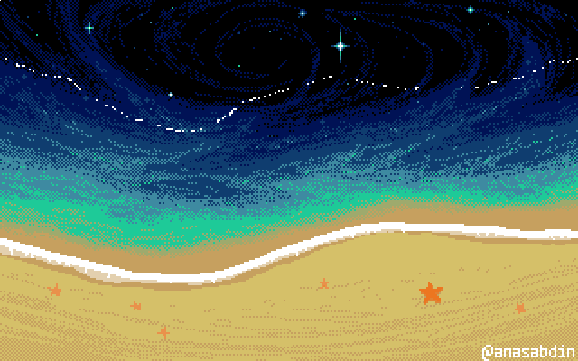

<div align="center">

# Gaby Lima

### Information Systems Student · Full Stack Developer · Information Security

<br>

> *"A necessidade é a mãe da inovação." (Platão)*

</div>



<div align="left">
  
## `> about_me`

</div>


<div align="left">

```text
Estudante de Sistemas de Informação
Desenvolvedora Web Full Stack
Interessada em Segurança da Informação e Dados
Construindo projetos com foco em organização, segurança e usabilidade
```
</div>

<br clear="right">

<div align="left">
  
## `> technologies`

<table border="0" cellspacing="0" cellpadding="0" style="border: 0;" width="100%">
  <tr>
    <td width="65%" valign="middle">

  <table border="0" cellspacing="0" cellpadding="0" style="border: 0;">
  <tr>
  <td width="30%" valign="middle" align="left">


  </td>

  <td width="70%" valign="middle" align="left">


  </td>
  </tr>
  </table>

  </td>

  <td width="35%" valign="middle" align="right">


  </td>
  </tr>
</table>

<br>

---

## `> featured_projects`

| Projeto | Descrição |
|---|---|
| **EcoLoc** | Sistema de localização e orientação para trilhas (Em andamento) |
| **Agendamento de Perícia Médica** | Sistema web para gerenciamento e agendamento de perícias |
| **Gestão de Processos de Pagamento** | Sistema para acompanhamento de processos, notas fiscais e pagamentos |

---

## `> contribution`

<div align="center">

<picture>
  <source media="(prefers-color-scheme: dark)" srcset="snake-dark.svg">
  <source media="(prefers-color-scheme: light)" srcset="snake.svg">
  
</picture>

</div>

---

<div align="center">

### `> let's connect`

<a href="SEU_LINKEDIN_AQUI">
  
</a>
<a href="mailto:SEU_EMAIL_AQUI">
  
</a>


</div>

