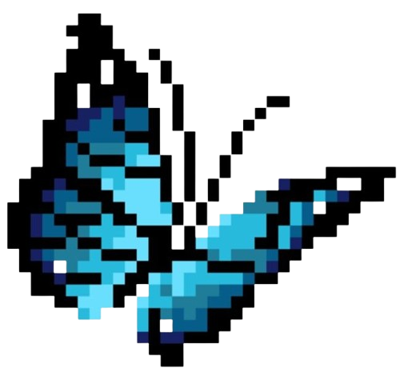

<div align="center">


</div>

<div align="left">
  
## `> sobre mim`

</div>


<div align="left">

```text
Estudante de Sistemas de Informação e Desenvolvedora Web Full Stack Jr., com experiência em
desenvolvimento e suporte de sistemas. Interessada em Segurança da Informação e Dados, com foco
em criar soluções organizadas, seguras e eficientes.
```
</div>

<div align="left">


  
## `> ferramentas`

<table border="0" cellspacing="0" cellpadding="0" width="100%">
  <tr>

  <td width="70%" valign="middle">

  <table border="0" cellspacing="0" cellpadding="0" width="100%">
    <tr>

  <td width="28%" valign="middle" align="center">
    
  </td>

  <td width="72%" valign="middle" align="left">
    
  </td>

  </tr>
  </table>

  </td>

  <td width="30%" valign="middle" align="center">
    
  </td>

  </tr>
</table>

---

## `> projetos`

<table border="0" cellspacing="0" cellpadding="0" width="100%">
  <tr>
    <td width="75%" valign="middle">

<table border="0" width="100%">
  <tr>
    <td><strong>EcoLoc</strong></td>
    <td>Sistema de localização e orientação para trilhas (Em andamento)</td>
  </tr>

  <tr>
    <td><strong>Agendamento de Perícia Médica</strong></td>
    <td>Sistema web para gerenciamento e agendamento de perícias</td>
  </tr>

  <tr>
    <td><strong>Gestão de Processos de Pagamento</strong></td>
    <td>Sistema para acompanhamento de processos, notas fiscais e pagamentos</td>
  </tr>
</table>

</td>

<td width="25%" valign="middle" align="center">

</td>
  </tr>
</table>

## `> contribuições`

<div align="center">

<picture>
  <source media="(prefers-color-scheme: dark)" srcset="snake-dark.svg">
  <source media="(prefers-color-scheme: light)" srcset="snake.svg">
  
</picture>

</div>

---

<div align="center">

### `> contatos`

<a href="SEU_LINKEDIN_AQUI">
  
</a>
<a href="mailto:SEU_EMAIL_AQUI">
  
</a>


</div>

